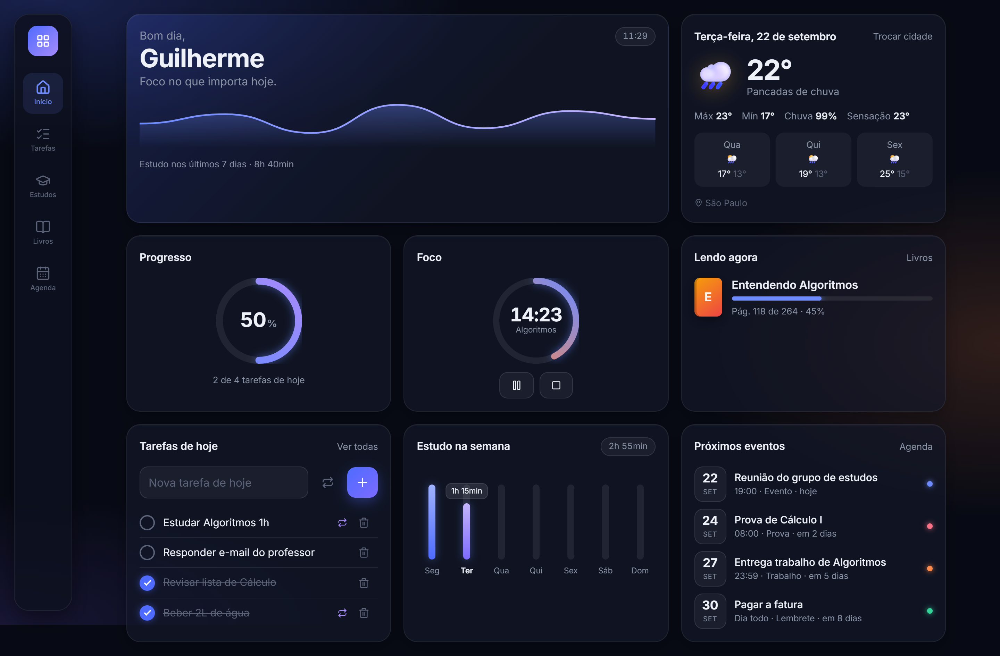

# Painel pessoal

Um painel para consultar todo dia, feito primeiro para o celular: clima, tarefas do dia e da semana, organização de estudos, estante de livros e agenda. Instala na tela inicial como um app (PWA) e sincroniza entre aparelhos em tempo real.

**No ar:** https://painel-guilherme.netlify.app

<p align="center">
  
</p>
<p align="center">
  
</p>

> As imagens usam dados de exemplo.

## Funcionalidades

- **Início** — saudação, clima, progresso das tarefas de hoje, timer de foco, livro em andamento, gráfico de estudo da semana e próximos eventos.
- **Tarefas** — listas do dia e da semana. Tarefas marcadas como repetidas voltam sozinhas todo dia (ou toda segunda-feira).
- **Estudos** — timer Pomodoro que registra a sessão ao terminar, disciplinas com meta semanal de horas, provas e trabalhos vindos da agenda e histórico de sessões.
- **Livros** — estante com status (lendo, quero ler, lido), progresso por página e contagem de livros lidos no ano.
- **Agenda** — calendário mensal com eventos, provas, trabalhos e lembretes.
- **Sincronização** — login com e-mail e senha; o que muda num aparelho aparece nos outros em cerca de 1 segundo.
- **Backup** — exportação e importação dos dados em JSON.

## Tecnologias

| Camada | Tecnologia |
|---|---|
| Interface | React 19, TypeScript, Vite |
| Estilo | CSS puro com variáveis (sem framework), layout mobile-first |
| App instalável | `vite-plugin-pwa` (manifest + service worker com atualização automática) |
| Banco e login | Supabase (PostgreSQL, Auth, Realtime) |
| Clima | [Open-Meteo](https://open-meteo.com) (gratuita, sem chave de API) |
| Hospedagem | Netlify |

## Como funciona

- **Dados em um só lugar.** Todas as telas acessam os dados por um Context do React ([`DadosProvider.tsx`](src/contexto/DadosProvider.tsx)). É o único arquivo que conversa com o banco.
- **Atualização otimista.** A mudança aparece na tela na hora e é enviada ao banco em seguida. O `localStorage` funciona como cache para o app abrir instantâneo.
- **Tempo real.** O app assina as mudanças das tabelas pelo Supabase Realtime e sincroniza de novo sempre que volta para a tela.
- **Segurança por linha (RLS).** Cada tabela tem políticas que só deixam o usuário logado ler e alterar as próprias linhas. A chave usada no navegador é a *publishable*; quem protege os dados são as políticas. O esquema completo está em [`supabase/migrations`](supabase/migrations).
- **Timer à prova de tela bloqueada.** O timer guarda o horário de término, não um contador. O tempo restante é sempre "fim − agora", então continua certo mesmo com o app em segundo plano.
- **Tarefas repetidas sem "reset".** A tarefa guarda em que dia (ou semana) foi concluída; se não for o período atual, ela aparece pendente.

## Rodando localmente

Pré-requisitos: Node.js 20+ e um projeto no [Supabase](https://supabase.com).

```bash
npm install
cp .env.example .env.local   # preencha com a URL e a chave publishable do seu projeto
npm run dev                  # http://localhost:5173
```

Para criar as tabelas, rode o SQL de [`supabase/migrations`](supabase/migrations) no SQL Editor do seu projeto.

### Scripts

| Comando | O que faz |
|---|---|
| `npm run dev` | Servidor de desenvolvimento |
| `npm run dev:rede` | Igual, mas acessível por outros aparelhos no mesmo Wi-Fi |
| `npm run build` | Checa os tipos e gera a versão de produção em `dist/` |
| `npm run lint` | Roda o linter (oxlint) |
| `npm run deploy` | Gera o build e publica na Netlify |

## Estrutura

```
src/
├── components/   partes reutilizáveis da tela (cartões, gráficos, timer, navegação)
├── contexto/     estado global e sincronização com o Supabase
├── hooks/        lógica reutilizável (localStorage, sessão, relógio, aba atual)
├── lib/          funções sem interface (datas, backup, sincronização, cliente Supabase)
├── paginas/      uma por aba: Início, Tarefas, Estudos, Livros, Agenda e Login
├── services/     APIs externas (clima)
└── tipos.ts      formato de todos os dados
```
